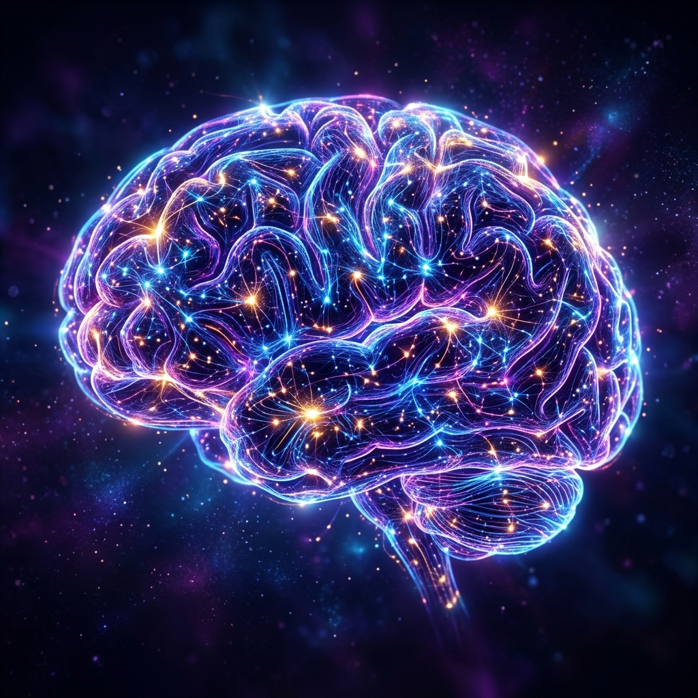

import { Aside } from "@astrojs/starlight/components";

## 総論
記憶を単なる「暗記」ではなく、脳の神経回路の可塑性（LTP）をいかに引き出すかという「技術」として捉え直します。本ページでは、池谷裕二氏の知見をベースに、大人（中学生以上）の脳が効率的に情報を定着させるための「論理性」「感情」「睡眠」「出力」の4つの柱について整理・解説します。

---

## 1. 意味の付与と論理的理解
<Aside type="tip">
**要約**: 脳（特に大人の脳）は「理解していないこと」をうまく覚えられません。情報に意味を持たせ、論理的な裏付けを与えることが記憶の第一歩です。
</Aside>

- **論理記憶へのシフト**: 小学生までは単純な丸暗記が得意ですが、中学生以降は論理だった「エピソード記憶」が主役となります。
- **規則性の発見**: 数値の羅列（例：1836547290）なども、その背後にある法則（奇数と偶数の交互配列など）を見抜くことで、1ヶ月後も忘れない強固な記憶へと変わります。
- **連合性の利用**: 脳には「連合性」という性質があり、既知の知識と新しい情報を結びつける（精緻化）ことで、微弱な刺激でも長期増強（LTP）が起こりやすくなります。

## 2. 感情と意欲の活用
<Aside type="tip">
**要約**: 感情が動くとき、脳内ではテータ（theta）リズムが発生し、記憶力は飛躍的に高まります。
</Aside>

- **興味と好奇心**: 覚えたい対象に対して「おもしろい」と感じる積極的な姿勢が、脳を最適な「記憶モード」に切り替えます。
- **適度な緊張感と刺激**: マンネリは記憶の敵です。初めての体験、感動、あるいは適度な危機感は、脳を活性化させLTPを誘発する強力なスパイスとなります。
- **ストレスの排除**: ストレスは記憶の最大の障害です。強いストレス下ではLTPが大きく減弱し、海馬の機能が抑制されてしまいます。
- **補足（カフェイン）**: カフェインには記憶力を促進する作用がありますが、耐性ができやすいため、ここぞという場面で戦略的に使用するのが効果的です。

## 3. 海馬のサイクルと睡眠
<Aside type="tip">
**要約**: 記憶は海馬で一時保存された後、睡眠中に整理・定着されます。適切な復習と十分な睡眠が不可欠です。
</Aside>

- **1ヶ月の猶予期間**: 海馬は情報を約1ヶ月間だけ保持します。この期間内に復習を繰り返すことで、脳は「必要な情報」と判断し、大脳皮質へ長期保存します。
- **睡眠による情報の整理**: 夢は記憶の整理プロセスそのものです。覚えた当日に6時間以上の睡眠をとることで、知識は「使える状態」に変換されます。
- **忘却と干渉**: 忘却を意図的に制御することはできません。しかし、類似した情報を追加して「記憶の干渉」を起こすことで、情報の整理を意図的に早めることも可能です。

## 4. 失敗からの学習と出力
<Aside type="tip">
**要約**: 脳は「入力」よりも「出力（アウトプット）」を重視します。失敗を恐れず、他者に説明することで記憶は完成します。
</Aside>

- **試行錯誤の重要性**: 脳は失敗を繰り返す過程で回路を強化します。失敗を「後悔」するのではなく「反省」の材料とし、改善を繰り返すことが習得への最短距離です。
- **大局から細部へ**: まずは全体像（スキーマ）を把握し、その後に詳細を埋めていく手順が、効率的な学習の鉄則です。
- **説明によるエピソード化**: 情報を他者に説明する行為は、単なる「意味記憶」を、自分の体験としての「エピソード記憶」へと昇格させ、定着率を劇的に向上させます。

---

## まとめ
効率的な記憶の鍵は、脳の特性を理解し、それに寄り添うことにあります。

1. **理解する**: 論理の糸で情報を繋ぎ、意味を見出す。
2. **動機づける**: 好奇心を持ち、テータ波を活性化させる。
3. **維持する**: 海馬の期限内に復習し、睡眠で整理する。
4. **出力する**: 実際に使い、説明することで自分の血肉にする。

記憶力は単なる才能ではなく、自ら磨き上げ、コントロールできる「技術」です。
