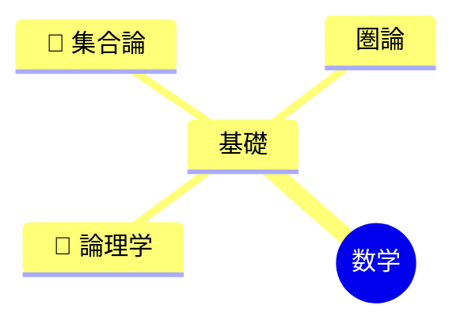
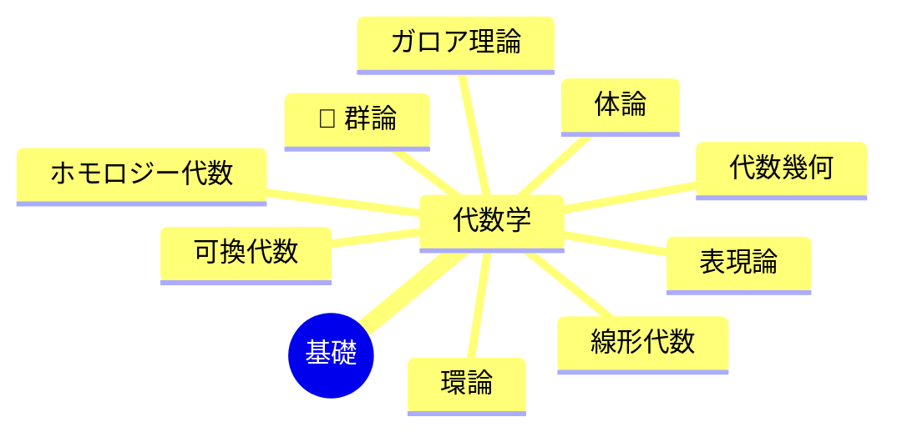
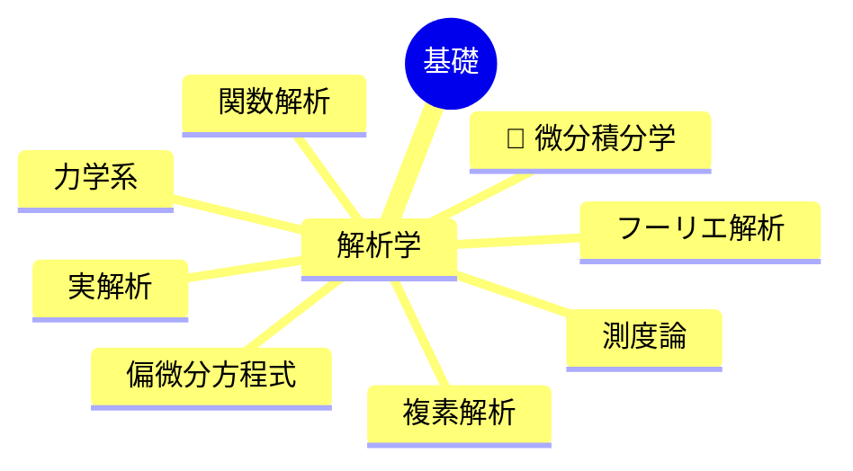
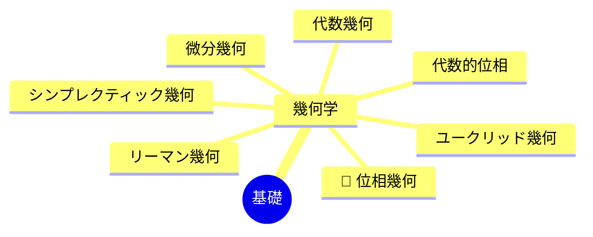
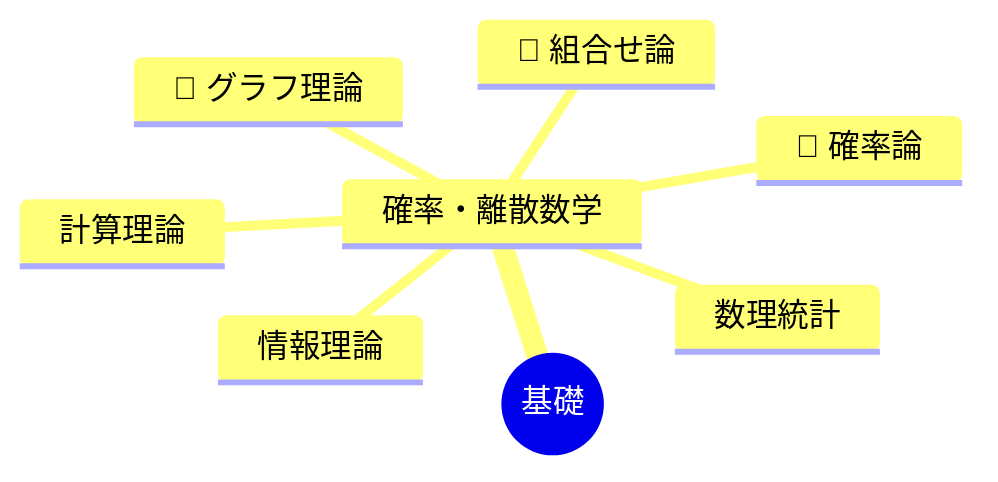

import FlatList from '/src/components/FlatList.astro';
import { LinkCard, Aside } from '@astrojs/starlight/components';
import FAQ from '/src/components/FAQ.astro';
import Statements from '/src/components/Statements.astro';

<Aside type="note" title="シリーズ記事（前編）">
この記事は「数学の全体像」シリーズの<b>前編</b>である。各分野のつながりを俯瞰したあとは、後編である「現代数学から見た数学の全体像」へ進むことをおすすめする。
</Aside>

数学の世界は非常に広大で、さまざまな分野が複雑に絡み合っている。ここでは、現代数学の主要な分野を分類し、それぞれの関係性を俯瞰するための全体像（マップ）を紹介する。現代数学は、論理や集合といった「基礎」をすべての土台（ルート）とし、そこから「代数学」「解析学」「幾何学」「確率・離散数学」という4つの大きな領域へと派生・発展していく階層構造を持っている。

## 数学の分野ツリー

数学全体を構成する各分野のつながりをツリー構造で示す。

<Aside type="tip">
  🔴マーク（および後述のオレンジ色の太字）が付いている項目は、各カテゴリーにおいて<b>1番最初に学ぶべき基礎分野</b>を示している。
</Aside>

## 各分野の簡単な紹介

数学の土台となる「基礎」と、そこから広がる4つの大きな柱について、それぞれの概要を解説する。

### 1. 基礎 (Foundations)
数学そのものの土台を構築する分野である。

<FlatList>
- <b class="text-orange-600 dark:text-orange-400">論理学</b>：正しい推論の規則を研究する。
- <b class="text-orange-600 dark:text-orange-400">集合論</b>：数学のあらゆる対象を「集合」として定義し、その性質を調べる。
- <b>圏論</b>：さまざまな数学的構造とその間の関係を抽象化して捉える、現代数学における強力な言語である。
</FlatList>

### 2. 代数学 (Algebra)
数や式の計算規則から出発し、構造そのものを抽象化して研究する分野である。

<FlatList>
- <b>線形代数</b>：ベクトル空間と線形写像を扱い、あらゆる理工学の基礎となる。
- <b class="text-orange-600 dark:text-orange-400">群論・環論・体論</b>：対称性（群）や、四則演算ができる構造（環・体）を調べる。
- <b>ガロア理論</b>：方程式の解の公式が存在するかどうかを群論を用いて解明する。
- <b>代数幾何</b>：多項式の解として定義される図形を代数的に研究する（幾何学との境界領域）。
</FlatList>

### 3. 解析学 (Analysis)
極限や連続といった概念を基盤とし、変化する量を研究する分野である。

<FlatList>
- <b class="text-orange-600 dark:text-orange-400">微分積分学</b>：関数の変化の割合（微分）と、微小な量の集積（積分）を扱う。
- <b>実解析・複素解析</b>：実数や複素数の世界で微分積分を厳密に展開する。
- <b>関数解析</b>：無限次元の空間（関数空間）を扱い、量子力学などの基礎にもなる。
- <b>測度論</b>：長さや面積、体積といった「測り方」を一般化・厳密化し、現代確率論の基礎となる。
</FlatList>

### 4. 幾何学 (Geometry)
空間の性質や図形の構造を研究する分野である。

<FlatList>
- <b>微分幾何・リーマン幾何</b>：微分積分を用いて、曲がった空間（曲面や多様体）の性質を調べる。アインシュタインの一般相対性理論の数学的記述にも用いられる。
- <b class="text-orange-600 dark:text-orange-400">位相幾何 (トポロジー)</b>：連続的に変形しても保たれる図形の性質（穴の数など）を研究する。
- <b>シンプレクティック幾何</b>：古典力学の相空間から派生した幾何学である。
</FlatList>

### 5. 確率・離散数学 (Probability and Discrete Math)
不確実性や、連続ではない（離散的な）構造を研究する分野である。

<FlatList>
- <b class="text-orange-600 dark:text-orange-400">確率論</b>・<b>数理統計</b>：偶然現象の法則性を記述し、データから背後にある構造を推測する。
- <b class="text-orange-600 dark:text-orange-400">組合せ論・グラフ理論</b>：有限な対象の数え上げや、点と線で構成されるネットワークの構造を調べる。
- <b>情報理論・計算理論</b>：情報の伝達・圧縮の限界や、コンピュータで「計算可能とは何か」を数学的に定式化する。
</FlatList>

## FAQ：よくある質問

<Statements>
  <FAQ title="Q. 数学の基礎となる分野は何ですか？">
    A. すべての数学的対象の土台となる「<b>論理学</b>」と「<b>集合論</b>」である。
  </FAQ>
  <FAQ title="Q. 現代数学を大きく分けるとどのような領域になりますか？">
    A. 主に「代数学」「解析学」「幾何学」「確率・離散数学」の4つの領域に分類され、これらが相互に関連し合って発展している。
  </FAQ>
</Statements>

## まとめ

数学の全体像を把握する上でのポイントは以下の通りである。

<FlatList>
- <b>「基礎」から派生する階層構造</b>：論理や集合などの「基礎」を共通の土台として、「代数学」「解析学」「幾何学」「確率・離散数学」の4大領域が構築されている。
- <b>各分野は独立していない</b>：例えば、「代数幾何学」は代数と幾何の融合であり、「解析的整数論」では解析学の手法を用いて数の性質を調べる。
- <b>つながりを意識する</b>：自分が興味のある分野が全体の中でどこに位置し、他のどの分野と繋がっているのかを意識すると、数学の学習がより面白くなる。
</FlatList>

 
<LinkCard
  title="次の記事へ（後編）：現代数学から見た数学の全体像"
  description="対象から「構造」と「写像」へ。現代数学者が頭の中で見ているさらに深い数学の地図を解説する。"
  href="/math/structures/0013_mathematics_overview_for_me/"
/>
