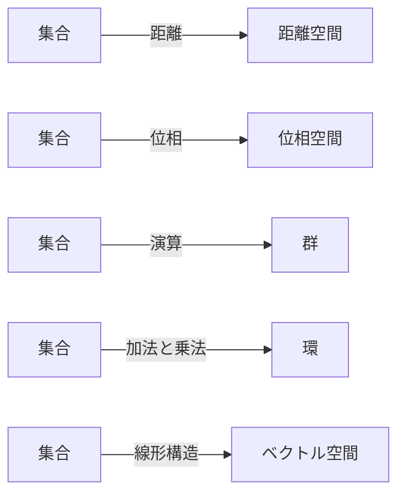
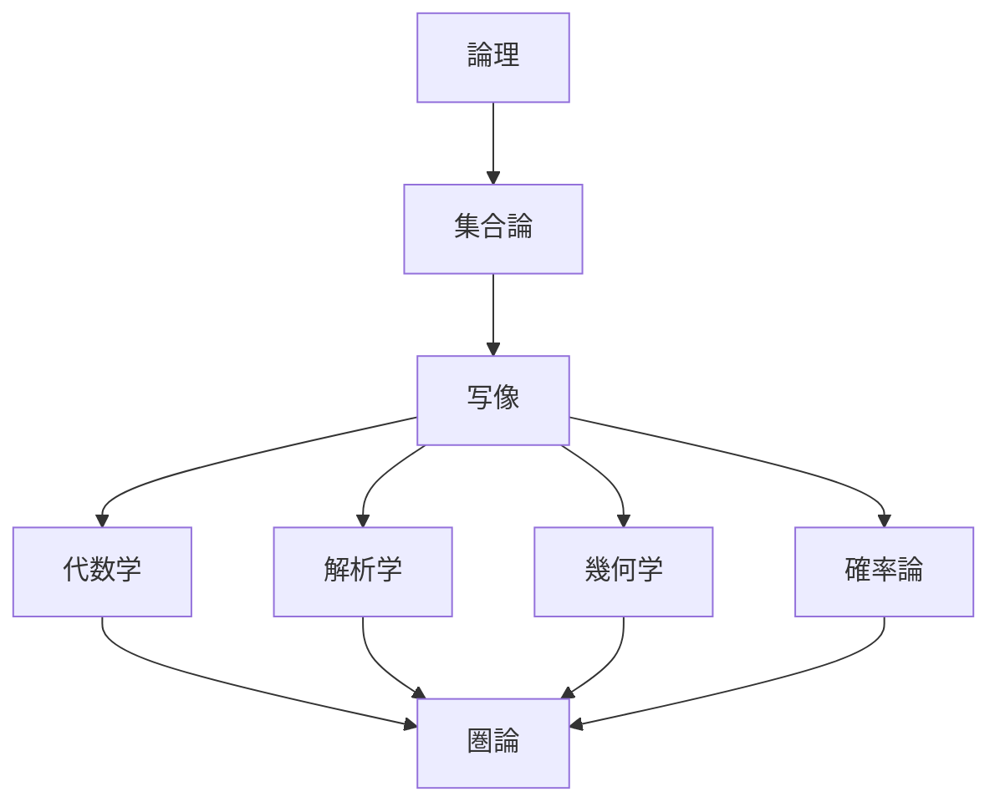

import Statement from "/src/components/Statement.astro";
import Statements from "/src/components/Statements.astro";
import FlatList from "/src/components/FlatList.astro";
import FAQ from "/src/components/FAQ.astro";
import { LinkCard, Aside } from '@astrojs/starlight/components';

<Aside type="note" title="シリーズ記事（後編）">
この記事は「数学の全体像」シリーズの<b>後編</b>である。前編の「数学の全体像マップ」をまだお読みでない方は、そちらを先にご覧いただきたい。
</Aside>

これまで、「集合・写像・論理が現代数学の基盤」「構造とは何か」「現代数学の視点で再構成したい」「集合とはなにか」「証明とは何か」といったテーマを考えてきたが、今回は<b>現代数学者が頭の中で見ている数学の地図</b>として全体像を説明する。

## 結論

現代数学から見ると、

<Statements>
    <Statement>
        数学とは「対象」ではなく、「構造」と「構造同士の関係」を研究する学問である。
    </Statement> 
</Statements>

という一文に集約される。高校までの数学では、
<FlatList>
- 数
- 図形
- 関数
が主役である。しかし現代数学では、
- 集合
- 写像
- 構造
</FlatList>
が主役になる。

## 古典的な数学観

古典的な数学では、具体的な「対象」そのものが研究の主役となる。例えば高校数学なら
<FlatList>
- 実数
- 三角形
- 円
- ベクトル
を学ぶ。このとき興味は<b>「その対象そのもの」</b>である。例えば
- 円の面積は？
- 三角形の性質は？
- 関数の極値は？
</FlatList>
を調べる。常に<b>対象中心</b>である。

## 現代数学の転換

数学の対象が多様化する中で、表面的な違いを超えた「共通の構造」を見出す視点が生まれた。19世紀以降、数学者は気づいた。実は
<FlatList>
- 数
- 図形
- 関数
</FlatList>
は全部違うように見えて、同じパターンが何度も現れる。

例えば、整数 $(ZZ, +)$ も、ベクトル $(RR^n, +)$も、<b>「足し算ができる」という共通構造を持っている。</b>すると興味は「整数」ではなく「足し算構造」になる。これが抽象代数学である。

## 現代数学の世界観

現代数学では、単なる「集合」の上に演算や距離などの「構造」を付与することで数学的対象を構成する。現代数学では、まず集合がある。その上に
<FlatList>
- 演算
- 順序
- 距離
- 位相
</FlatList>
などの構造を載せる。イメージとしては

である。例えば

## 現代数学の中心は写像

現代数学において最も重要なのは対象そのものではなく、対象同士の関係性を記述する「写像」である。ここが最も重要である。現代数学では対象より対象間の関係が重要である。つまり
$$
f: A -> B
$$
である。例えば、群を学ぶときも群そのものより群準同型
$$
phi.alt: G -> H
$$
を重視する。位相空間でも連続写像
$$
f: X -> Y
$$
を重視する。線形代数でも線形写像
$$
T: V -> W
$$
が主役である。

## なぜ写像が重要か

写像を調べることで、異なるように見える対象同士が構造的に同じであるか（本質）を判定できるからである。写像を見ると、対象の本質が見えるからである。

例えば、正方形と円は違う。しかし、伸ばしたり縮めたりして互いに移れるなら、位相数学では同じである。つまり、対象ではなく「どんな写像で結ばれるか」が本質になる。

## 数学全体を1枚で描くと

数学全体は、論理と集合を土台とし、写像と構造を介して各分野へと派生し、さらに圏論へと至る階層構造を持つ。

である。

### 代数学
構造を研究する。
<FlatList>
- <b>例</b>： 群、環、体、ベクトル空間
- <b>問い</b>： 「どんな演算構造があるか」
</FlatList>

### 幾何学
空間を研究する。
<FlatList>
- <b>例</b>： ユークリッド空間、多様体、位相空間
- <b>問い</b>： 「空間の形とは何か」
</FlatList>

### 解析学
極限を研究する。
<FlatList>
- <b>例</b>： 微分、積分、関数空間
- <b>問い</b>： 「連続的変化とは何か」
</FlatList>

### 確率論
不確実性を研究する。
<FlatList>
- <b>問い</b>： 「ランダムとは何か」
</FlatList>

## さらに現代的な見方

対象の中身を完全に忘却し、<b>対象間の「写像同士の関係」</b>のみに着目する<b>圏論（Category Theory）</b>へと発展した。20世紀後半以降は、対象より関係という考え方がさらに進んだ。そこで現れたのが Category Theory（圏論）である。圏論では

を研究する。極端に言うと、

> 「対象の中身は見なくていい」

という思想である。

## 学習との関係

大学以降の数学を学ぶ際は、すべての分野を「集合・構造・写像」という統一的な視点で捉えることが不可欠である。いま重要になるのは、これらが現代数学の入り口だからである。数学者の頭の中では

という順番で世界ができている。そして、微積分も線形代数も群論も位相も全部

> 「集合に構造を入れ、写像で比較する」

という一つの統一原理で見えている。この意味で現代数学の全体像を一言で表すなら、

<Statements>
    <Statement>
        <b>数学とは、集合の上に定義された構造と、その構造を保つ写像を研究する学問</b>
    </Statement>
</Statements>

となる。さらに一歩進めると、

<Statements>
    <Statement>
    <b>数学とは、「何が同じで、何が違うのか」を厳密に記述するための学問</b>
    </Statement>
</Statements>

という見方もできる。これは集合論、代数学、解析学、幾何学、そして圏論まで貫く、非常に現代的な数学観である。

## FAQ：よくある質問

<Statements>
  <FAQ title="Q. 現代数学において最も重要な概念は何ですか？">
    A. 対象そのものではなく、対象間の関係性を記述する「<b>写像</b>」である。写像を調べることで、対象の構造的な本質が見えてくるからである。
  </FAQ>
  <FAQ title="Q. 現代数学の世界観を一言で表すとどうなりますか？">
    A. 「<b>集合の上に定義された構造と、その構造を保つ写像を研究する学問</b>」である。
  </FAQ>
</Statements>

## まとめ

本記事の要点は以下の通りである。
<FlatList>
- <b>主役の交代</b>： 古典的な「対象」そのものの研究から、現代数学では「集合」「構造」「写像」へと関心がシフトしている。
- <b>構造の付与</b>： 単なる集合に対して演算や距離などの構造を入れることで、数学的対象（群、位相空間など）が生まれる。
- <b>写像の重視</b>： 対象同士を関連付ける写像（準同型、連続写像など）を調べることで、対象の本質的な同一性が理解できる。
- <b>統一的な視点</b>： 異なる分野（代数・幾何・解析）も、「集合に構造を入れ、写像で比較する」という同一の原理の上に成り立っている。
</FlatList>

 
<LinkCard
  title="前の記事に戻る（前編）：数学の全体像"
  description="現代数学の主要な分野と、それらの関係性についての全体像（マップ）を紹介する。"
  href="/math/structures/0013_mathematics_overview/"
/>
