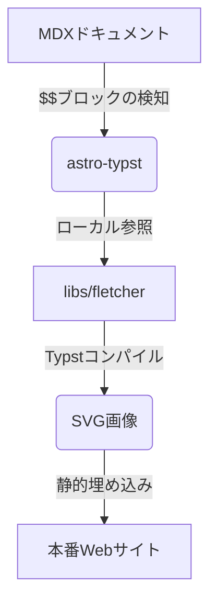

import { Steps, Aside, Code, LinkCard } from '@astrojs/starlight/components';

数学図式や関係図を Astro + Starlight で美しく描画したい場合、**Fletcher** は非常に強力なライブラリである。従来利用していた D2 などの描画ツールに比べ、Fletcher は Typst の強力な表現力をそのまま生かせるため、数式フォントやデザインがドキュメント全体と完璧に調和する。

**結論として、Fletcher をローカルの `libs/fletcher` に配置し、MDX 内の `$$` ブロックで呼び出すことで、D2 を完全に廃止した統一的で美しい描画環境を構築できる。**

---

## クイックQ&A

<Aside type="note" title="Q. なぜ D2 から Fletcher へ移行するのですか？">
**A**: D2 は外部ツールや別エンジンでの描画に依存するため、数式フォントの統一や細かな位置・デザイン調整が困難であった。**Fletcher** を使用すれば、Typst のネイティブな描画能力を利用して、フォント・グリッド・線の太さ・余白に至るまで、数学ドキュメントと完全に一致した美しい図表を出力できるためである。
</Aside>

---

## 1. Fletcher 移行のメリット

D2 と Fletcher の特徴を比較すると以下のようになる。

| 比較項目 | D2 (移行前) | Fletcher (移行後) |
| :--- | :--- | :--- |
| **レンダリングの美しさ** | 標準的な図形。数式フォントとの調和が薄い | 極めて高品位。Typst の数式表現と完全調和 |
| **テキストの折り返し** | 折り返し指定が冗長 | 自然な折り返しが可能 |
| **位置調整とグリッド** | 自動レイアウト（制御が難しい場合がある） | グリッド座標系 `(col, row)` による正確な制御 |
| **依存関係** | 外部バイナリ (`d2`) のインストールが必要 | ローカルの Typst ソースコードのみで完結 |


### レンダリングプロセス

FletcherがAstroのビルド時にどのように処理されるかのフローを示す。



---

## 2. 導入と設定手順

Fletcher を Starlight プロジェクトに導入し、安定動作させるまでの手順を示す。

<Steps>
1. ### ライブラリのローカル配置
   インターネット上にある通常の Fletcher をそのまま配置しただけでは、Astro 環境での絶対パス解決などの仕様によりビルドエラーが発生する。そのため、Astro / Starlight 向けにパスのパッチ適用を行っている以下の GitHub リポジトリから、`libs/fletcher` を取得してプロジェクトルートに配置する。

   <LinkCard
     title="GitHub: astro-starlight-typst"
     description="パッチ適用済みの fletcher ソースコードを公開している。ルートディレクトリの libs フォルダを参照。"
     href="https://github.com/tomohikoseven/astro-starlight-typst"
   />

2. ### astro.config.mjs のルートパス設定
   Typst のコンパイル時に絶対パス `/libs/fletcher/...` でインポートできるよう、`astro.config.mjs` にて `astro-typst` のルートを設定する。

   ```javascript
   // astro.config.mjs
   import { typst } from 'astro-typst';

   export default defineConfig({
     integrations: [
       typst({
         target: () => "svg"
       }),
     ]
   });
   ```

3. ### MDX ファイル内でのインポートと記述
   MDX ファイルの `$$` ブロック内で以下のようにライブラリをインポートして記述する。

   ```typst
   #import "/libs/fletcher/src/exports.typ" as fletcher: diagram, node, edge
   ```
</Steps>

---

## 3. 実装のベストプラクティス：関数の極限・連続性・微分

実際に `high_school/0302_limit_of_functions_and_derivative` の関係図を D2 から移行した際の実装例をもとに、Fletcher の強力な機能と調整の工夫点を解説する。

### 3.1. 実際のコード

以下の Typst コードを記述することで、グリッド座標系に基づいた綺麗な関係図がレンダリングされる。

```typst
$$
#import "/libs/fletcher/src/exports.typ" as fletcher: diagram, node, edge

#align(center)[
  #diagram(
    spacing: (80pt, 50pt),
    node-stroke: 0.6pt,
    
    // Nodes
    node((0, 0), [関数の極限]),
    node((1, 0), [関数の連続性]),
    node((0, 1), [微分 \ =分数の極限]),
    node((1, 1), [グラフの形の近似]),
    node((0, 2), [微分可能性 \ =形の判定 \ （なめらか，角ばった）]),
    
    // Edges
    edge((0, 0), (1, 0), "-"),
    edge((0, 0), (0, 1), "-|>", label: [分数の形], label-side: left),
    edge((0, 1), (1, 1), "-"),
    edge((0, 1), (0, 2), "-|>", label: [微分の連続性], label-side: left),
  )
]
$$
```

### 3.2. デザイン調整のポイント

- **グリッドスペースの最適化**:
  `spacing: (80pt, 50pt)` と指定し、横方向の間隔を `80pt`、縦方向の間隔を `50pt` に設定している。ノード内の文字列（例: 「**微分可能性**」など）が長い場合でも、隣接するノードや線と重ならないように設計されている。
- **改行の制御**:
  ノードのラベル内で改行を行うには、Typst の標準ルールに従ってバックスラッシュ（`\`）を使用する。
- **矢印ラベルの位置決定**:
  `edge(..., label-side: left)` を使用することで、下向きの矢印の左側に文字がぴったりと寄り添うように配置され、図全体のバランスが良くなる。

---

## 4. 実際のレンダリング結果

上記コードによって実際に描画されるダイアグラムは以下の通りである。

$$
#import "/libs/fletcher/src/exports.typ" as fletcher: diagram, node, edge

#align(center)[
  #diagram(
    spacing: (80pt, 50pt),
    node-stroke: 0.6pt,
    
    // Nodes
    node((0, 0), [関数の極限]),
    node((1, 0), [関数の連続性]),
    node((0, 1), [微分 \ =分数の極限]),
    node((1, 1), [グラフの形の近似]),
    node((0, 2), [微分可能性 \ =形の判定 \ （なめらか，角ばった）]),
    
    // Edges
    edge((0, 0), (1, 0), "-"),
    edge((0, 0), (0, 1), "-|>", label: [分数の形], label-side: left),
    edge((0, 1), (1, 1), "-"),
    edge((0, 1), (0, 2), "-|>", label: [微分の連続性], label-side: left),
  )
]
$$

---

## まとめ：移行プロセスの要約

Fletcher を使ったダイアグラム構築のプロセスは以下の通り。

* **ローカル配置**: WASM やネットワークに依存しない安定版を `libs/fletcher` に置く。
* **グリッドレイアウトの採用**: ノードは `(col, row)` で位置指定し、`spacing: (Xpt, Ypt)` で全体のバランスを整える。
* **統一された美学**: 数式フォントやストロークが他の文書パーツと自動で揃うため、統一感のあるプレミアムな外観が得られる。
