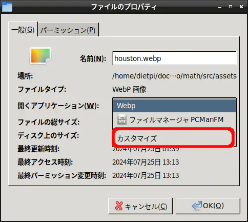
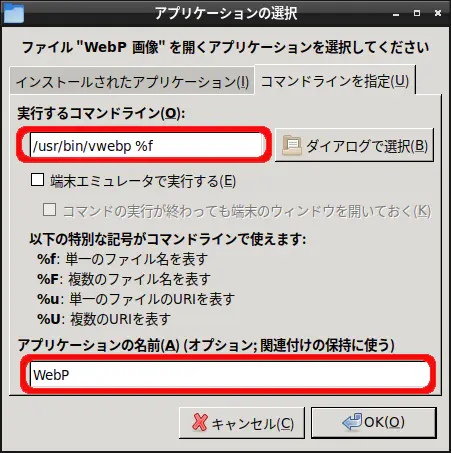

　[webpをインストール](/software/webp_install_in_raspi4/)したのはいいが，コマンド実行で表示するのは面倒である．ファイルマネージャーからダブルクリックして表示するのが使いやすい．

　下記にファイル（拡張子）と関連付けてアプリケーションを実行する手順を示す．

## ファイルと関連付け
1. ファイルマネージャーから該当ファイルを右クリックし，プロパティを開く．
1. `一般`タブ > 開くアプリケーション の`カスタマイズ`を選択する．

1. `コマンドラインを指定`タブの`実行するコマンドライン`に`/usr/bin/vwebp %f`を入力する．

1. `アプリケーションの名前`にわかりやすい名前を入力する．（入力後，OKを押す．）
1. ファイルのプロパティの`OK`ボタンを押し，完了する．

　以上の設定を行った上で，webpファイルをダブルクリックすると，画像が表示される．