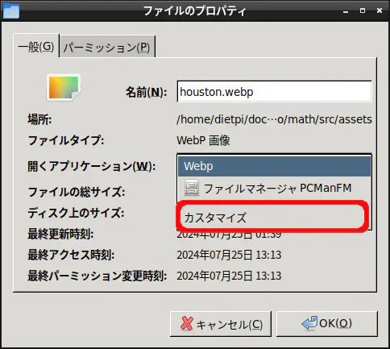
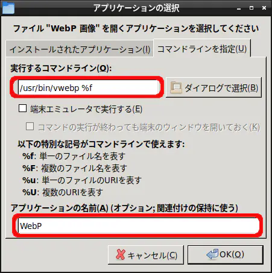

import { Steps } from '@astrojs/starlight/components';

Raspberry Piのファイルマネージャーにおいて、特定の拡張子（例：webp）を任意のアプリケーションに関連付けるには、ファイルのプロパティから「**カスタマイズ**」を選択し、実行するコマンドラインを指定する。これにより、ファイルをダブルクリックするだけで指定のアプリケーションで開くことが可能となる。

[webpをインストール](/software/raspberrypi/install_webp/)した後など、毎回コマンドラインから実行するのが面倒な場合に非常に有効である。

## ファイルとの関連付け手順

ファイル（拡張子）と関連付けてアプリケーションを実行する具体的な手順は以下の通りである。

<Steps>

1. ファイルマネージャーから該当のファイル（今回はwebpファイル）を右クリックし、「**プロパティ**」を開く。

1. 「**一般**」タブを開き、「開くアプリケーション」の右側にある「**カスタマイズ**」を選択する。
   

1. 「**コマンドラインを指定**」タブを開き、「実行するコマンドライン」に、対象のコマンド（例：`/usr/bin/vwebp %f`）を入力する。
   

1. 「**アプリケーションの名前**」に、自分がわかりやすい名前を入力し、「**OK**」を押す。

1. ファイルのプロパティの「**OK**」ボタンを押して設定を完了する。

</Steps>

## まとめ

* ファイルマネージャーから任意の拡張子とアプリケーションを関連付けることができる。
* ファイルのプロパティ内「開くアプリケーション」をカスタマイズし、コマンドライン（`%f`などファイル引数を含む）を指定する。
* GUIでのダブルクリック操作だけで、指定したアプリケーションを用いてファイルを開くことができるようになる。